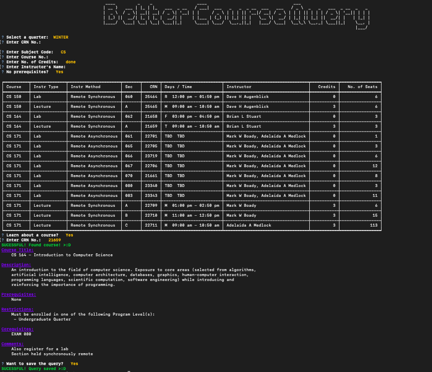

# BetterClassQuery
An application that helps you find the courses you're looking for! Need a 1-credit class to add up to that perfect 20-credit max? Or need that easy no-prereq class to fill up your gened's. No worries, the BetterClassQuery is there to help!

# Demo

## MVP:
Webscrape: 
* Get all courses from specific quarter
* Organize by quarter -> school -> major -> course

Query: 

* Ask which quarter to query
* Able to get courses by course name, professor, crn, prereqs, and credits

## @ TODO

* Change from flat-file db to sqlite for faster querying
* Add multiprocessing to web scraping to shorten run-time
* Add website option (most likely Flask app) and host on tux
